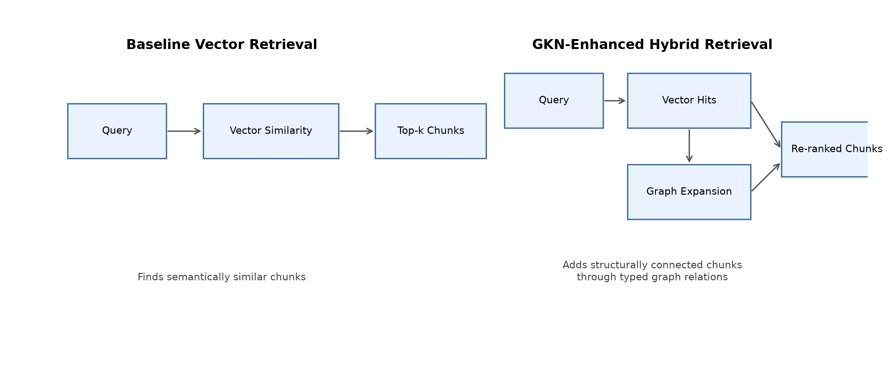
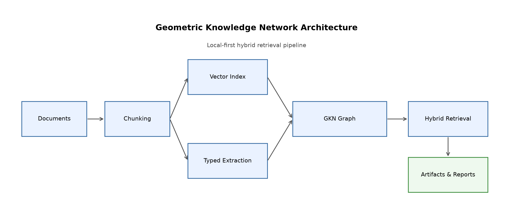
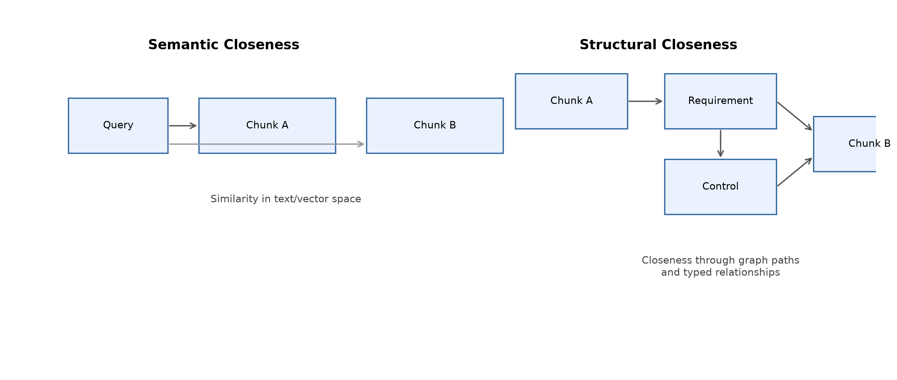
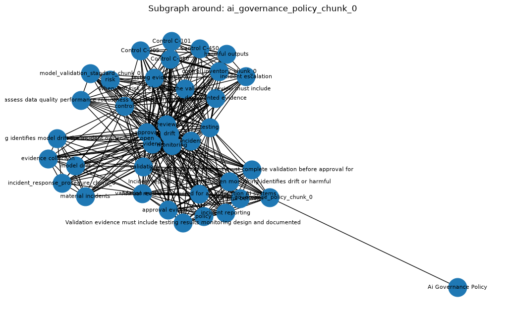

# Mathematical Formulation of the Geometric Knowledge Network

This document provides a technical but intuitive description of the current **Geometric Knowledge Network (GKN)** used in this repository.

The goal is not to claim a complete formal knowledge graph or a fully learned graph geometry model. Instead, the objective is to describe the current MVP precisely enough that readers can understand:

- how the network is constructed
- what mathematical objects it contains
- how retrieval is scored
- how graph structure differs from vector similarity
- why a GKN may provide additional insight beyond embedding-based retrieval alone

---

## 1. High-level intuition

A traditional embedding-based retriever answers the question:

> **Which chunks are semantically close to this query?**

A Geometric Knowledge Network adds another question:

> **Which chunks are structurally connected to relevant concepts, requirements, controls, incidents, or evidence?**

So the retrieval problem becomes a hybrid one:

- **semantic closeness** in text/vector space
- **structural closeness** in a graph of typed relationships

In this repository, the GKN combines:

1. a **vector similarity layer**
2. a **typed document-grounded network layer**
3. a **hybrid retrieval rule** that uses both

### Illustration: two views of retrieval

<p align="center">
  
</p>

---

## 2. Corpus and chunk representation

Let the corpus be a set of documents:

```text
D = {d1, d2, ..., dn}
```

Each document is chunked into retrieval units:

```text
C = {c1, c2, ..., cm}
```

Each chunk has metadata such as:

- document ID
- chunk ID
- text span
- source path
- character offsets

So a chunk can be viewed as:

```text
c_i = (id, doc_id, text, start, end)
```

The current MVP uses simple local chunking, but the mathematical role of a chunk is clear: it is the basic retrieval unit.

---

## 3. Typed entity extraction

For each chunk `c_i`, the system extracts a set of typed entities:

```text
E(c_i) = {e_i1, e_i2, ..., e_ik}
```

Each extracted entity has:

- a unique ID
- a label
- a type
- a confidence score

So an entity can be represented as:

```text
e = (id, label, type, confidence)
```

### Current entity types

The current MVP includes the following node/entity types:

- **Requirement**
- **Control**
- **Evidence**
- **Incident**
- **Concept**

Extraction is currently heuristic and rule-based. For example:

- phrases with `must`, `shall`, `required` tend to generate **Requirement** nodes
- phrases like `Control C-101` generate **Control** nodes
- phrases containing evidence-like language generate **Evidence** nodes
- drift / incident language generates **Incident** nodes

This extraction is not yet a learned semantic parser. It is a pragmatic structured layer over the text.

---

## 4. Graph construction

The knowledge network is represented as a graph:

```text
G = (V, E)
```

where:

- `V` is the set of nodes
- `E` is the set of typed edges

### 4.1 Node sets

The node set is the union of:

```text
V = V_D ∪ V_C ∪ V_E
```

where:

- `V_D`: document nodes
- `V_C`: chunk nodes
- `V_E`: extracted entity nodes

So the graph explicitly contains both source-document structure and extracted conceptual structure.

### Illustration: network layout

<p align="center">
  
</p>

---

## 5. Edge semantics

The graph currently uses typed edges such as:

- `CONTAINS`
- `MENTIONS`
- `REQUIRES`
- `SUPPORTS`
- `TRIGGERS`
- `RELATED_TO`

### 5.1 Document containment

If document `d` contains chunk `c`, then:

```text
(d, c) ∈ E_CONTAINS
```

### 5.2 Chunk mentions entity

If chunk `c` mentions entity `e`, then:

```text
(c, e) ∈ E_MENTIONS
```

### 5.3 Entity-entity structure

If two entities co-occur in a chunk and satisfy certain type-pair rules, they may be connected by a typed edge such as:

```text
(e_a, e_b) ∈ E_REQUIRES, E_SUPPORTS, E_TRIGGERS, or E_RELATED_TO
```

Examples:

- Requirement–Control may induce `REQUIRES`
- Evidence–Requirement may induce `SUPPORTS`
- Incident–Control may induce `TRIGGERS`
- otherwise the edge may default to `RELATED_TO`

So the total edge set can be viewed as:

```text
E = E_CONTAINS ∪ E_MENTIONS ∪ E_REQUIRES ∪ E_SUPPORTS ∪ E_TRIGGERS ∪ E_RELATED_TO
```

### Illustration: an example evidence path

```text
Document
  -> Chunk
      -> Requirement
      -> Evidence
      -> Control
```

---

## 6. Semantic closeness in the baseline retriever

The baseline retriever scores chunks by semantic similarity to the query.

Let the query be `q`. Let `phi(.)` denote the text representation used by the baseline retriever.

In the current MVP, `phi` is a TF-IDF vectorizer, so baseline similarity is:

```text
s_vec(q, c_i) = cos(phi(q), phi(c_i))
```

The baseline top-k result set is:

```text
R_base(q) = TopK over chunks of s_vec(q, c_i)
```

This gives a ranking based only on textual similarity.

### Intuition

This baseline is good at finding chunks that are lexically or semantically similar to the query. But it does not directly represent:

- support structure
- requirement-control links
- incident-control interactions
- evidence neighborhoods
- multi-hop structural relevance

---

## 7. Structural closeness in the GKN

A graph introduces a second notion of closeness.

Instead of asking only whether two texts are semantically similar, we can ask whether two nodes are near each other in the graph:

```text
dist_G(u, v)
```

where `dist_G` is shortest-path distance in the graph.

This induces a notion of structural closeness:

```text
closeness_G(u, v) ∝ 1 / dist_G(u, v)
```

for connected nodes.

### Intuition

Two chunks may not be nearest neighbors in text space, but they may still be structurally close if they:

- mention the same typed entities
- link to related evidence or controls
- lie within a short graph path through relevant concepts

This is exactly the type of relation a vector store alone does not explicitly encode.

### Illustration: semantic vs structural closeness

<p align="center">
  
</p>

---

## 8. Hybrid retrieval in the current MVP

The hybrid retriever begins with baseline vector hits and then uses the graph to expand and re-score candidates.

### Step 1: baseline seed set

Take the top-k baseline results:

```text
S(q) = {c_(1), c_(2), ..., c_(k)}
```

### Step 2: local graph neighborhood

For each seed chunk `c`, compute the graph neighborhood within hop cutoff `h`:

```text
N_h(c) = {v in V : dist_G(c, v) <= h}
```

### Step 3: graph bonus

The current MVP assigns a heuristic graph bonus based on the number of nearby structured nodes and their local connectivity.

A simplified version of the implemented score is:

```text
b(c) = alpha * n_structured(c) + beta * n_related(c)
```

where:

- `n_structured(c)` counts nearby typed nodes such as Requirement, Control, Evidence, Incident, or Concept
- `n_related(c)` captures how connected those nearby nodes are
- `alpha, beta > 0` are heuristic weights

In the current implementation, these are fixed hand-tuned coefficients.

### Step 4: hybrid score

For seed chunks, the final score is:

```text
s_hyb(q, c) = s_vec(q, c) + b(c)
```

### Step 5: graph-expanded chunk candidates

The retriever may also add neighboring chunk candidates if they are within hop distance `h` of a seed chunk:

```text
c' in C, and dist_G(c, c') <= h
```

These candidates receive a structural score based on graph distance, for example:

```text
s_expand(c') = max over c in S(q) of lambda / dist_G(c, c')
```

for some fixed `lambda > 0`.

These expanded chunk candidates are then merged with the baseline seeds and reranked.

### Illustration: hybrid expansion

```text
Query
  -> top-k vector chunks
      -> graph neighborhood
          -> additional chunk candidates
              -> final reranked set
```

---

## 9. Two notions of closeness

The current system therefore combines two fundamentally different retrieval signals.

### 9.1 Semantic closeness

```text
semantic closeness(q, c) = cos(phi(q), phi(c))
```

This captures textual / representational similarity.

### 9.2 Structural closeness

```text
structural closeness(c_i, c_j) ∝ 1 / dist_G(c_i, c_j)
```

This captures graph proximity through typed relationships.

### Combined view

A GKN-enhanced retriever is useful when:

- semantic closeness alone is insufficient, and
- structural closeness adds relevant context or support

In practice, that means the query may benefit from both:

- *what is textually similar?*
- *what is structurally connected to what is textually similar?*

---

## 10. Why this may provide better insight than embedding-only retrieval

A vector retriever gives a powerful but limited form of relevance:

> these chunks are close in text representation space

A GKN can add a different kind of insight:

> these chunks are linked through requirements, controls, evidence, incidents, or related structure

### 10.1 Embedding-based retrieval is strong when

- relevant evidence is textually similar to the query
- answers are local and directly stated
- no explicit multi-hop structure is needed

### 10.2 A GKN is especially useful when

- a question requires support tracing
- the best supporting chunk is not the nearest semantic neighbor
- multiple related documents encode the answer across structure rather than in one location
- governance or evaluation requires explicit inspectability

### 10.3 Why this matters conceptually

Embedding retrieval gives **neighborhood in semantic space**.

A knowledge network gives **neighborhood in relational space**.

Those are not the same thing.

That is the core reason a GKN can offer additional insight.

---

## 11. Important current limitation

The current MVP does **not yet prove** that the present GKN always outperforms baseline retrieval.

That distinction matters.

At the current stage, the repository demonstrates:

- the construction of a document-grounded typed graph
- hybrid scoring over semantic and structural information
- a framework for comparing baseline and hybrid retrieval

But whether the GKN provides **measurable retrieval gain** depends on:

- corpus size
- graph sparsity vs density
- quality of extraction
- edge semantics
- how query-aware the graph scoring becomes

So the current claim should be framed carefully:

> A GKN provides a principled way to add structural insight beyond embedding similarity, but the extent of measurable improvement must be validated empirically.

---

## 12. Future mathematical improvements

The current MVP uses heuristic graph weights. A more advanced version could formalize the hybrid score more rigorously.

For example, one could define:

```text
s(q, c) = alpha * s_vec(q, c) + beta * s_path(q, c) + gamma * s_prov(q, c)
```

where:

- `s_vec`: embedding-based relevance
- `s_path`: path-based graph relevance
- `s_prov`: provenance / evidence support score
- `alpha, beta, gamma`: tunable weights

One could also make graph relevance explicitly query-aware:

```text
s_path(q, c) = sum over paths p in P(q, c) of w(p)
```

where:

- `P(q, c)` is a set of graph paths linking query-relevant concepts to chunk `c`
- `w(p)` is a path weight that depends on edge types, node types, and confidence scores

This would move the system closer to a more formal graph-geometric retrieval model.

---

### Illustration: example subgraph from the current MVP

<p align="center">
  
</p>

## 13. Bottom line

The current Geometric Knowledge Network in this repository is mathematically best understood as a **hybrid retrieval graph** over:

- documents
- chunks
- typed extracted entities
- typed structural relations

with retrieval driven by both:

- semantic similarity in vector space
- structural closeness in graph space

This is the core distinction from traditional embedding-only retrieval.

A vector store answers:

> **What is close?**

A Geometric Knowledge Network aims to answer:

> **What is close, and what is structurally connected in a meaningful way?**

That is the central mathematical and practical idea behind this project.
